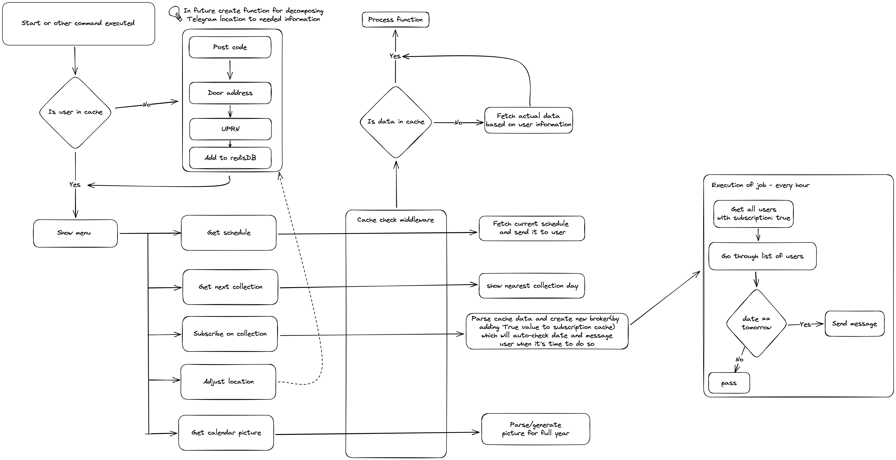

# bincollection_bot
At this moment bot support only Adur&Worthing Council information.  
# ▹ Installation #
> [!NOTE]  
> For start make sure you have python and redis and mongodb installed on your machine.
``` Bash
git clone https://github.com/denver-code/bincollection_bot
cd bincollection_bot
```   
Rename ```sample.env -> .env``` and don't forget to change the settings inside.
# ▹ Run using docker #
> [!NOTE]  
> For start make sure you have docker installed on your machine.
```bash
sh scripts/run.sh
```
or
``` bash
docker-compose up --build -d
```
# ▹ Run #
> [!NOTE] Make sure you have installed poetry on your machine (pip3 install poetry)
``` Bash
poetry install
poetry run python3 -m bot
```

# Edit project in VS Code
``` bash
poetry install
poetry shell
code .
```

## Concept scheme of bot

